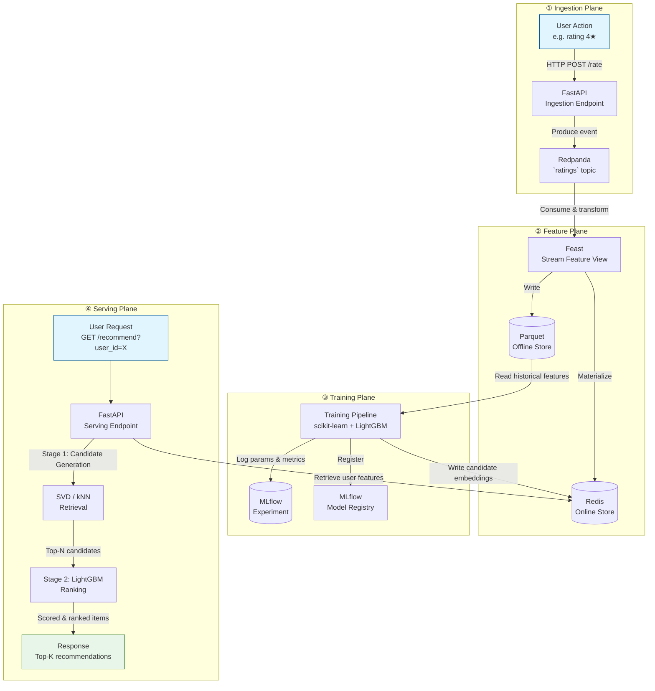

# RecoStack Architecture

> **Status**: Living document — reflects the target architecture. Will be updated as implementation reveals what actually works.
> **Last updated**: 2026-07-27 (Phase 3)

---

## 1. Overview

RecoStack is a **fully local, open-source, two-stage recommendation system** built on the MovieLens dataset. It combines a streaming ingestion layer (Redpanda), a feature store (Feast), a model training pipeline (scikit-learn + LightGBM tracked in MLflow), a low-latency serving API (FastAPI + Redis), and monitoring (Prometheus + Grafana) — all orchestrated with Docker Compose.

The system is designed to run on a single developer machine with no cloud dependencies. Every component is containerized or runs in-process.

### High-Level Principles

- **Two-stage retrieval + ranking**: Candidate generation is cheap and broad; ranking is expensive and precise.
- **Feature store as the single source of truth**: All features (user stats, movie metadata, interaction aggregates) are defined, computed, and served through Feast.
- **Streaming-first ingestion**: User interactions arrive via Redpanda topics, enabling near-real-time feature updates.
- **Local-only**: No external SaaS, no cloud APIs, no data leaves the machine.

---

## 2. Component Responsibility Table

| Component | Role | Key Technology | Data It Owns / Consumes |
|---|---|---|---|
| **Redpanda** | Message broker — ingests raw user interactions (ratings, clicks) in real time | Redpanda (Kafka API–compatible) | Raw interaction events (`ratings` topic) |
| **Feast** | Feature store — defines, computes, and serves features for training & inference | Feast + Redis (online store) + Parquet (offline store) | User features, item features, interaction aggregates |
| **Redis** | Online feature cache — low-latency (<10 ms) feature lookups at serving time | Redis | Materialized feature values (user embeddings, movie stats) |
| **Training Pipeline** | Offline job — reads historical features from Feast, trains candidate-generation & ranking models | scikit-learn (SVD/kNN), LightGBM | Trained model artifacts (`.pkl` / `.txt`) |
| **MLflow** | Experiment tracker & model registry — logs params, metrics, and artifacts | MLflow | Run history, model registry, metrics |
| **FastAPI** | Serving API — exposes `/recommend` endpoint, orchestrates retrieval + ranking | FastAPI + Uvicorn | Request/response payloads |
| **Prometheus** | Metrics collector — scrapes API and pipeline metrics | Prometheus | Time-series counters, histograms, latencies |
| **Grafana** | Dashboard — visualizes system health and recommendation quality | Grafana | Dashboard configs (dashboards from Prometheus) |
| **Docker Compose** | Orchestration — wires all services together with networking, volumes, and dependencies | Docker Compose | Service definitions, env vars, port mappings |

---

## 3. End-to-End Data Flow

The system has four major data planes. Below is the full path an interaction takes from ingestion through training to serving.

### Flow Walkthrough

1. **Ingestion**: A user rates a movie. FastAPI receives the event and publishes it to Redpanda's `ratings` topic.
2. **Feature computation**: Feast's stream feature view consumes the topic, computes rolling aggregates (user mean rating, genre affinity, etc.), and writes them to both the online store (Redis) and the offline store (Parquet).
3. **Training**: The training pipeline reads historical features from Feast's offline store, trains a matrix-factorization model (SVD) for candidate retrieval and a LightGBM model for ranking, logs everything to MLflow, and pushes the trained embeddings back to Redis.
4. **Serving**: A user requests recommendations. FastAPI fetches the user's features from Redis, runs candidate generation (retrieves ~100 candidate movies), scores each with the ranking model, and returns the top-K.

---

## 4. Design Decisions

### 4.1 Why two-stage (retrieval + ranking)?

The 98.3% sparsity we measured in Phase 2 makes this almost mandatory:

- **Single-stage approaches** (e.g., scoring all 9,724 movies with a complex model) are too slow for a real-time API — a LightGBM inference on every movie would take hundreds of milliseconds per request.
- **Two-stage decouples scale from accuracy**: Stage 1 uses a cheap method (SVD dot product or kNN) to narrow 9,724 → ~100 candidates. Stage 2 applies an expensive, feature-rich model to just those 100.
- This is the same pattern used by YouTube, Pinterest, and Spotify in production — just scaled down to a laptop.

### 4.2 Why a feature store (Feast)?

Without a feature store, feature engineering is ad-hoc: pandas scripts scattered across notebooks, inconsistent definitions between training and serving, and silent training-serving skew.

- **Single definition**: Feast lets us define a feature once (e.g., `avg_user_rating_7d`) and use it in both training and serving.
- **Time-travel**: Feast's offline store supports point-in-time joins, so training examples never leak future information.
- **Online serving**: The same feature definition materializes to Redis for low-latency lookups.
- For a local project, Feast is admittedly heavy — but it's the closest open-source analogue to what production teams use (Uber's Michelangelo, Airbnb's Zipline).

### 4.3 Why Redpanda over plain batch files?

The MovieLens dataset is static (100K ratings from 2018), so streaming is technically unnecessary. We're using Redpanda because:

- **It forces real-time architecture**: If we built everything on CSV files, the system would never be able to handle live data. Redpanda gives us the same API as Kafka without the JVM overhead.
- **It enables future data**: Once the pipeline works, we can swap MovieLens for a live feedback loop.
- **Pedagogical value**: The point of RecoStack is to learn production patterns. Streaming ingestion is a core production pattern.
- Redpanda over Kafka: Redpanda is a single binary (no ZooKeeper, no JVM), which is much simpler to run in Docker Compose on a laptop.

### 4.4 Why local-only?

- **Reproducibility**: No cloud credentials, no network dependencies, no surprise bills.
- **Focus on the ML pipeline**: The interesting part is the recommendation logic, not IAM roles or VPC configuration.
- **Portability**: Anyone can clone the repo and run `docker compose up` without configuring external services.
- The trade-off is scale: Redis on a single node, Feast with a local Parquet backend, Prometheus scraping localhost. This is fine for a learning project and a 100K-rating dataset.

### 4.5 Why LightGBM over neural networks?

- **Data volume**: 100K ratings is too small for deep learning. Tree-based models (LightGBM, XGBoost) consistently outperform neural nets on tabular data at this scale.
- **Interpretability**: LightGBM feature importance is straightforward to explain and visualize.
- **Speed**: LightGBM inference is sub-millisecond per batch of 100 candidates, which is critical for the ranking stage.
- Neural networks could be added later (as an optional `recostack[nn]` extra) if the dataset grows.

### 4.6 Why Prometheus + Grafana for a local project?

- **Industry standard**: Prometheus + Grafana is the most widely adopted monitoring stack in the Kubernetes/cloud-native ecosystem.
- **Low overhead**: Both run as lightweight Docker containers and require minimal configuration.
- **Tangible output**: Seeing real-time latency histograms and recommendation-quality dashboards makes the system feel alive in a way that log files don't.

---

## 5. Future-Proofing Notes

As we build, this document will inevitably diverge from reality. That's expected and healthy. Specific things that may change:

- **Feast complexity**: If Feast's local setup proves too cumbersome, we may simplify to pandas-only feature computation with a manual Redis sync.
- **Redpanda scope**: If the streaming pipeline adds latency without value for a static dataset, we may fall back to batch ingestion with a flag to enable streaming.
- **Model architecture**: The two-stage design is fixed, but the specific retrieval method (SVD vs. kNN vs. lightweight matrix factorization) will be decided empirically in Phase 5.
- **Service boundaries**: Some components (e.g., the ingestion endpoint) may merge into the FastAPI serving app to reduce Docker Compose complexity.

When divergences happen, this doc gets updated — not the other way around.